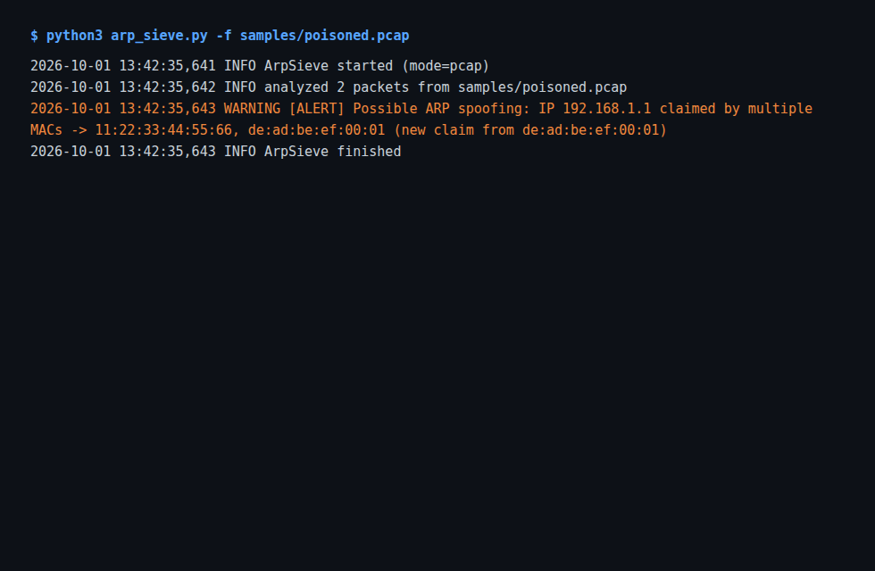
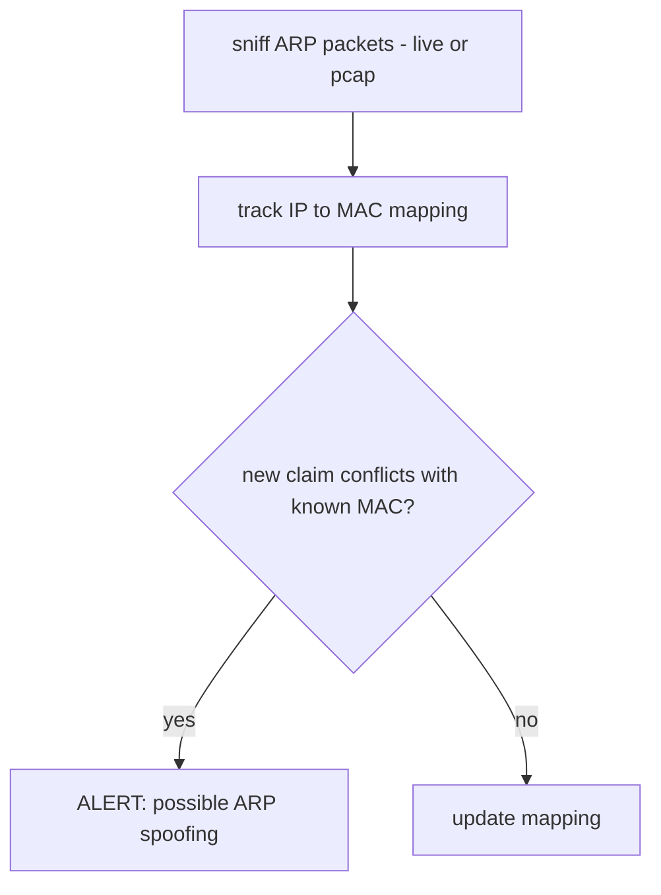

# ArpSieve

A small Python tool that watches ARP traffic on the local network
segment and alerts when something claims an IP address that already
belongs to another MAC. That is the signature of an ARP cache poisoning
or man-in-the-middle attack.

## What it does

- Real-time ARP monitoring on a live interface
- Offline PCAP analysis (`-f/--pcap`) for incident review or testing
- ARP spoofing/poisoning detection
- MAC-to-IP mapping verification
- Alerts to console and log file

## How it works

ArpSieve captures ARP packets on the local interface and keeps a table
of known MAC-to-IP mappings. When a conflicting ARP announcement shows
up (two different MAC addresses claiming the same IP), it raises a
man-in-the-middle alert.

## Usage

```bash
# Live monitoring (requires root / CAP_NET_RAW):
sudo python3 arp_sentinel.py -i eth0

# Offline analysis of a capture (no root needed):
python3 arp_sentinel.py -f capture.pcap
```

## Stack

- Python 3.x
- scapy
- Standard library (argparse, logging)

## Author

Boluwaji Oluwaseyi Adepoju

## Test captures

`samples/` has two ARP captures used to validate detection:

- `benign.pcap`: normal ARP traffic, no alert expected
- `poisoned.pcap`: an ARP cache-poisoning attempt. Running the tool on
  it raises the man-in-the-middle alert.

```bash
python3 arp_sentinel.py -f samples/poisoned.pcap
```

## Screenshot

Real alert on the poisoned capture:



## Flow


